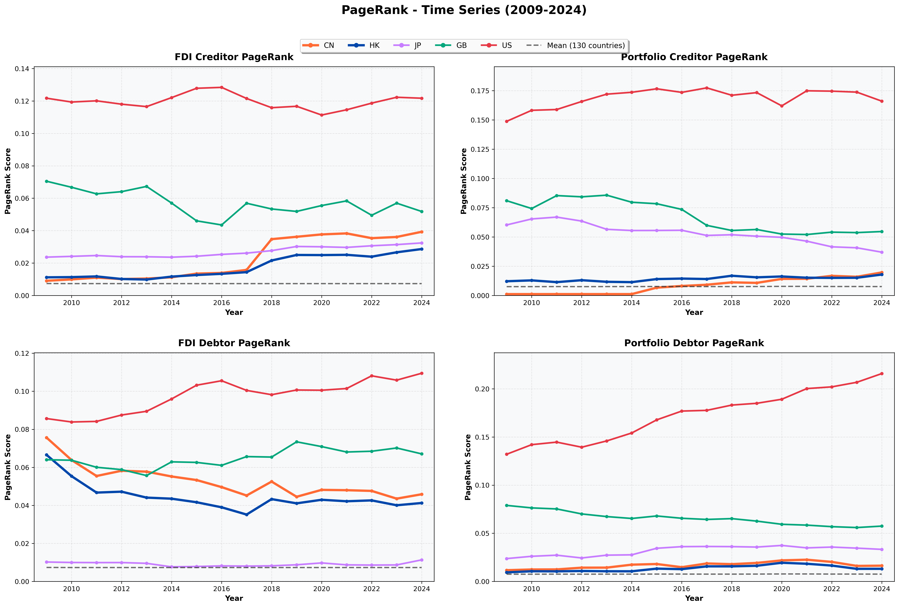

A gallery of figures and network maps from my research.

### Featured topics

- Global investment networks (FDI & Portfolio, 2009–2024)  
- Centrality of financial hubs (US, HK, Japan, China)  
- Spillovers through banking and bond markets  

*(Figures will be added soon.)*
## Global Financial Network (2010-2024)

<figure>
  
  <figcaption>
    <em>Figure 1.</em> Global financial network hubs and concentration patterns, 2009–2024.
  </figcaption>
</figure>

## US Treasury Volatility and Mutual Fund Liquidity Management

<figure>
  
  <figcaption>
    <em>Figure 2.</em> Fund Flows During COVID-19 Pandemic Announcement and Fed Intervention.
  </figcaption>
</figure>

## Equilibrium in which firms issue nearly redundant securities to investor with participation constraints

<figure>
  
  <figcaption>
    <em>Figure 3.</em> Factors to consider during Islamic bonds issuance decision.
  </figcaption>
</figure>

